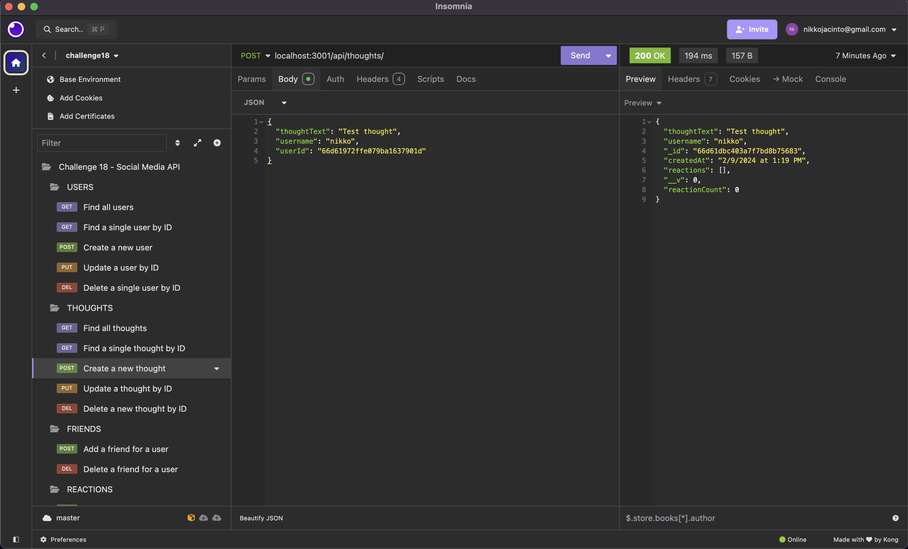

# 18-Social-Network-API

        
## Description
            
This project is an API for a social network web application where users can share their thoughts, react to friends’ thoughts, and create a friend list. It uses Express.js for routing, a MongoDB database, and the Mongoose ODM (object data modeling).

I built this application as a simple way for users to interact by sharing thoughts, adding reactions to thoughts and adding or removing friends in a simulated 'social media' environment. 

By completing this project, I've expanded my capabilities in using the MongoDB document-oriented database framework and better understand the use cases for a 'NoSQL' product.

### Video walkthrough showing application functionality:

To view a video walkthrough of how to seed some user data, run the server and access the data via its API routes using Insomnia, watch [a video demonstration here](https://drive.google.com/file/d/1WjZDVYZH9JOEtKvn-d2V16snv2eQKYEk/view). 

### Screenshots of using the application's API routes to manage data:

The screenshots below show the application's API routes being called in Insomnia to return specific data.  

- GET route to display all users:

- DELETE route to remove a friend for a user:

- POST route to create a thought:

            
## Table of Contents
            
- [Installation](#installation)
- [Usage](#usage)
- [License](#license)
- [Contributing](#contributing)
- [Tests](#tests)
- [Questions](#questions)
            
## Installation

To install this application, you'll need to clone the repository to your local machine. [Refer to this guide from GitHub if you need help.](https://docs.github.com/en/repositories/creating-and-managing-repositories/cloning-a-repository/)

Once cloned, you will need to navigate to the project's folder in your terminal and run the following command to install the necessary dependencies: `npm install`.

Next, you will need MongoDB installed on your computer to initialise the database. [Visit MongoDB's website for links to download and installation instructions.](https://www.mongodb.com/)

Lastly, you'll also need to install the API client Insomnia, which you can do by [visiting their website here](https://insomnia.rest/). 

            
## Usage

Once all of the steps in [Installation](#installation) have been completed, you can optionally seed the database by entering: `node utils/seed.js`. Then to start the server, enter: `node index.js`

If everything was installed and run correctly, you should be able to test the API routes using Insomnia now. Check the [walkthrough video here to see how you can view, add, update or delete data using these routes.](https://drive.google.com/file/d/1WjZDVYZH9JOEtKvn-d2V16snv2eQKYEk/view)
            
## License
            
MIT License

Copyright (c) 2024 ImNeeeks
            
Permission is hereby granted, free of charge, to any person obtaining a copy
of this software and associated documentation files (the "Software"), to deal
in the Software without restriction, including without limitation the rights
to use, copy, modify, merge, publish, distribute, sublicense, and/or sell
copies of the Software, and to permit persons to whom the Software is
furnished to do so, subject to the following conditions:
            
The above copyright notice and this permission notice shall be included in all
copies or substantial portions of the Software.
            
THE SOFTWARE IS PROVIDED "AS IS", WITHOUT WARRANTY OF ANY KIND, EXPRESS OR
IMPLIED, INCLUDING BUT NOT LIMITED TO THE WARRANTIES OF MERCHANTABILITY,
FITNESS FOR A PARTICULAR PURPOSE AND NONINFRINGEMENT. IN NO EVENT SHALL THE
AUTHORS OR COPYRIGHT HOLDERS BE LIABLE FOR ANY CLAIM, DAMAGES OR OTHER
LIABILITY, WHETHER IN AN ACTION OF CONTRACT, TORT OR OTHERWISE, ARISING FROM,
OUT OF OR IN CONNECTION WITH THE SOFTWARE OR THE USE OR OTHER DEALINGS IN THE
SOFTWARE.
            
## Contributing

N/A
            
## Tests

N/A
     
## Questions
            
If you have any questions, please reach out at either of the following:
            
### GitHub profile:
- https://github.com/ImNeeeks

### Email:
- nikkojacinto@gmail.com